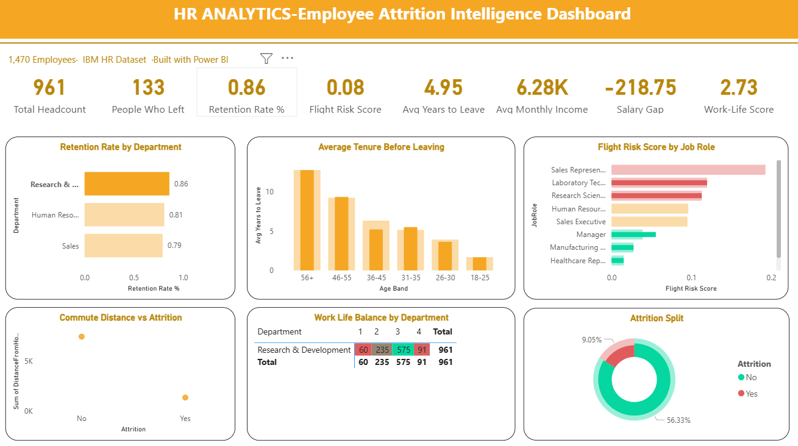

# HR Analytics Dashboard (Power BI)

## 📊 Overview
This project presents an interactive HR Analytics dashboard built using Power BI to analyze employee data and understand key factors influencing attrition and workforce trends.

## 🧹 Data Cleaning
The dataset was cleaned and transformed using Microsoft Excel and Power BI (Power Query):
- Removed null and duplicate values
- Standardized column formats
- Cleaned categorical fields (Department, Job Role, Education)
- Created calculated columns for better analysis

## 🎯 Key Metrics
- Total Employees
- Attrition Count
- Attrition Rate (%)
- Average Age
- Average Salary
- Years at Company

## 📈 Features
- Attrition analysis by department
- Employee distribution by age group
- Salary and job role analysis
- Department-wise insights
- Interactive dashboard with filters

## 🛠 Tools Used
- Power BI
- Microsoft Excel
- Power Query

## 📸 Dashboard Preview

## 🔍 Key Insights
- Certain departments show higher attrition rates
- Younger employees tend to leave more frequently
- Salary and experience impact employee retention
- Majority workforce falls within mid-age group

## 📂 Files
- HR Analytics dashboard.pbix
- Dataset file
- Dashboard image

## 🚀 How to Use
1. Download the .pbix file
2. Open using Power BI Desktop
3. Explore the dashboard with filters

## 💡 Skills Demonstrated
- Data Cleaning
- Data Analysis
- Data Visualization
- Dashboard Development
- Business Intelligence
